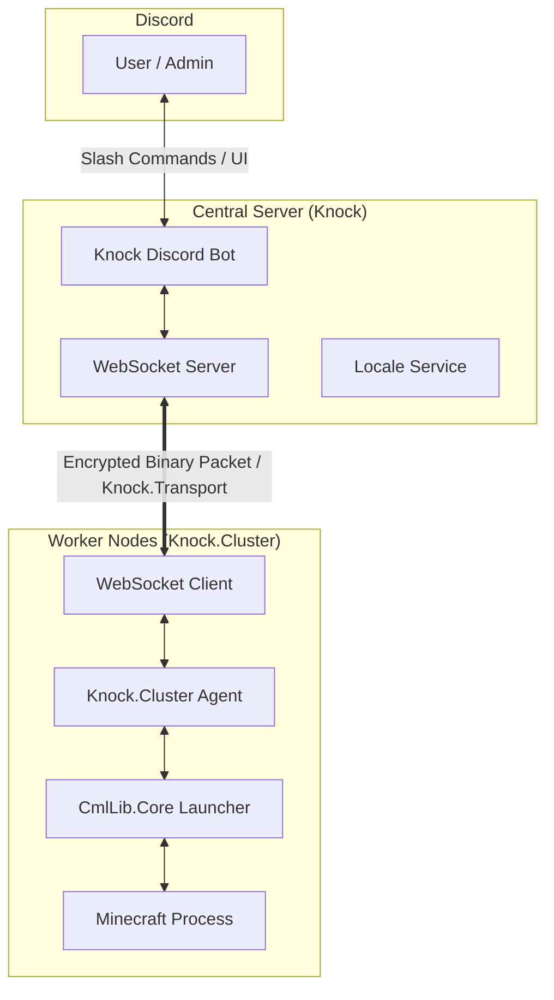

# Knock

Discordからマインクラフトサーバーを統合管理するための、分散型サーバー管理システムです。

## 概要

Knockは、Discordをインターフェースとして、複数のホスト（クラスター）上で動作するマインクラフトサーバーを制御することを可能にします。中央制御を担う **Knock (Bot)** と、実際にマイクラを動作させる **Knock.Cluster (Agent)** の2コンポーネントで構成されており、独自のセキュアな通信プロトコルによって連携します。

## 主な機能

- **Discord連携**: スラッシュコマンド、ボタン、セレクトメニュー、モーダルを活用した直感的な操作。
- **分散クラスター構成**: 1つのBotで、物理的に異なる場所にある複数のPC/サーバー上のマイクラを管理。
- **高セキュリティ**: 通信層（Knock.Transport）にて、AES暗号化と独自バイナリプロトコルを採用。
- **高度なサーバー管理**: 
  - バージョン、Forge、プラグイン等の動的な設定変更。
  - リアルタイムなコンソールログのDiscordへのストリーミング。
  - ホワイトリストやオーナー権限の管理。
- **多言語対応**: 日本語および英語をフルサポート。

## システムアーキテクチャ



## プロジェクト構成

- **Knock**: メインアプリケーション。Discord Botとして動作し、WebSocketサーバーをホストします。
- **Knock.Cluster**: 各ホストマシンで実行されるエージェント。マイクラサーバーのプロセス管理を担います。
- **Knock.Transport**: 通信の心臓部。パケットの定義、AES暗号化/復号、シリアライズ処理を行います。
- **Knock.Shared**: プロジェクト全体で共有されるモデルやエラーハンドリングの共通基盤。

## 技術スタック

- **Language**: C# / .NET 8.0
- **Discord API**: [Discord.Net](https://github.com/discord-net/Discord.Net)
- **Minecraft Launcher**: [CmlLib.Core](https://github.com/AlphaBs/CmlLib.Core)
- **Communication**: [Fleck](https://github.com/statianzo/Fleck) (Server), [WebSocket4Net](https://github.com/kerryjiang/WebSocket4Net) (Client)
- **Encryption**: AES-256 (Custom Implementation)
- **Logging/UI**: [NLog](https://nlog-project.org/), [Spectre.Console](https://spectreconsole.net/)

## クイックスタート

### 前提条件
- .NET 8.0 SDK
- Discord Bot Token

### セットアップ

1. **リポジトリのクローン**
   ```bash
   git clone https://github.com/your-repo/Knock.git
   cd Knock
   ```

2. **設定 (Knock / Bot)**
   `Knock/appsetting.json` を編集します。
   - `token`: Discord Botのトークン。
   - `address`: クラスターが接続するWebSocket待ち受けアドレス (例: `ws://0.0.0.0:54321`)。

3. **設定 (Knock.Cluster / Agent)**
   `Knock.Cluster/appsetting.json` を編集します。
   - `server-address`: 上記で設定したKnock Botのアドレス。
   - `local-address`: 自身のノードを識別するためのアドレス。

4. **実行**
   ```bash
   # Botの起動
   dotnet run --project Knock

   # クラスターの起動
   dotnet run --project Knock.Cluster
   ```

---
© 2026 4rna-y
